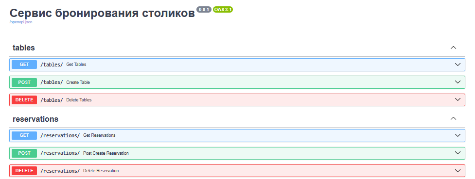

<h4>Запуск контейнера:</h4>

    docker-compose up -d

База данных подключается и наполняется таблицами на старте приложения.
Сеть между контейнерами настроена.

Полная документация сервиса с описанием каждого запроса собрана в свагере.

<h4>Архитектура</h4>

    - database: подключение к базе данных, стракутура таблиц, модели таблиц
    - docs: описание ответов запросав для свагера
    - log: конфигурация логера
    - reservation: структура работы бронирования столов, запросы, модели параметров запросов, исполнительный файл, вспомогательные модели
    - tables:  структура работы создания столов, запросы, модели параметров запросов, исполнительный файл, вспомогательные модели
    - app.py: исполнительный файл запуска приложения, обработчиков
    - requirements.txt: файл установки используемых библиотек сервиса
    - .env: файл скрываемых параметров (ключи и тд)
    - test_progect.postman_collection.json: постман файл запросов (на всякий случай)

Запросы разделил по папкам reservation и tables по причине того что это разные сущности и проще работать с ними по отдельности чем хранить все в одной папке типа "service"
